# Tool School: Benchmarking 101 (How To Read AI Model Report Cards)
*Learn to read the scorecard behind every AI model launch*

*This is the second article in my Tool School series - 101 guides for the tools AI-native work actually requires. Each article covers one tool, from zero to confident.*

1. *[GitHub 101](https://hannahstulberg.substack.com/p/tool-school-github-101) takes you from "I've never used GitHub" to making your first real contribution.*
2. *Benchmarking 101 (this article) teaches you how to read the scorecard behind every AI model launch.*

Over the past year, Anthropic, OpenAI, and Google have released almost 40 AI models. Each release comes with a benchmark scorecard - a table of acronyms like ARC-AGI-2 and GPQA Diamond, percentage improvements over the last version, and claims about what the model can now do better. If you're not already literate in these terms, the scorecards are almost impossible to read.

I've never been able to understand what any of these releases actually mean or how they should change the way I work. A new model would launch every couple of weeks and I'd have the same questions each time: What changed? Should I go try this one? If I've been on Opus 4.6, should I switch to GPT-5.4? And if I did switch, what kind of task should I try it on? It takes real time to test and experiment with a new model and I've never known how to decide which ones are worth that investment.

The frustrating part wasn't that the information didn't exist. It was that it existed in a form that assumed I already understood it. I could feel the differences between models - for example, Opus 4.6 was clearly better than Opus 4.5. But I couldn't explain why or articulate what had actually changed. Cursor has a feature that lets you run the same prompt across multiple models at the same time and compare the answers side by side. It also lets you switch between models mid-conversation. I never knew when I should use either feature. I work primarily in Claude Code using Opus 4.6, and I never had a good answer for when I should go try Gemini or GPT instead. Without understanding which models are good at what, it's hard to know when to experiment.

The goal of this article is to teach AI benchmark literacy. So that when a model launches and the scorecard comes out, you understand what the numbers mean, which scores matter, which ones are noise, and most importantly, why any of this matters for you.

I teamed up with [Akshat Khandelwal](https://www.linkedin.com/in/akshatkhandelwal/), a product manager at DoorDash and the writer behind *[Help Me Unpack](https://helpmeunpack.substack.com/)*, to write this guide together. Help Me Unpack breaks down the macro forces shaping AI and technology - infrastructure, economics, and the business models, explained so you understand the substance behind the headlines. Akshat is the person who taught me how to read a benchmark table and I wanted every reader of this article to have that same experience: someone who can walk you through scoring, methodologies, and the reasons one number matters and another is noise.

This is part of my Tool School series. Subscribe to get these guides straight to your inbox every week - and if you're already here for free, upgrading to paid helps more people discover this content (Substack's algorithm favors creators with paid subscribers) and supports the work that goes into creating it.

[SUBSCRIBE BUTTON]

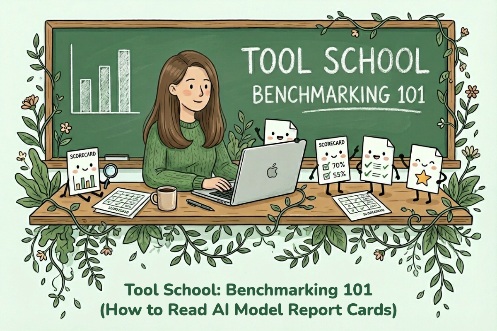

### By the end of this article, you'll have:

- **A clear understanding of what benchmarks are and how AI models are scored:** What's actually being tested, how the scoring works, and why different tests exist for different capabilities.
- **The major benchmarks by category and which ones still matter:** The tests that matter for coding, reasoning, math, and general knowledge, as well as how to spot when a benchmark has expired or been compromised.
- **The ability to read a real benchmark scorecard and a head-to-head model comparison:** What each number means, what to focus on, and what to watch for in any model launch announcement.
- **An understanding of when and why cost matters:** The dimension most benchmark tables leave out entirely.
- **The confidence to read the next launch yourself:** You'll apply everything in this guide to the Opus 4.6, Sonnet 4.6, and GPT-5.4 launch announcements.

**Here's how this guide is organized:**

- **The pace of change: 40 models in 14 months:** Every major model launch from the past 14 months and how this accelerating pace should inform your approach to building with AI.
- **Benchmarks 101:** What benchmarks actually measure, how models are scored, and every major benchmark you'll encounter in a launch announcement.
- **You can now read the scorecard:** Everything you've learned so far, applied to a real benchmark table from Anthropic's Opus 4.6 launch.
- **How to read the next model launch:** Head-to-head comparisons and 4 things to watch for in any announcement.
- **What the scorecard leaves out:** The cost dimension that most benchmark tables leave out entirely and why performance-per-dollar might matter more than raw scores.

## The short version

*Everything you need to read the next model launch in 2 minutes.*

Every AI model launch comes with a scorecard. Here's the framework for reading it.

**The 4 major categories of benchmarks:**

1. **Knowledge & Reasoning:** Academic and professional knowledge tests (MMLU, GPQA Diamond, HLE, GDPval)
2. **Coding:** Whether models can write code that actually works (SWE-bench Pro, SWE-Lancer)
3. **Reasoning:** Novel problem-solving the model has never seen before (ARC-AGI-3, ARC-AGI-2)
4. **Agentic & Computer Use:** Whether models can do sustained, multi-step professional work (OSWorld, tau2-bench, BigLaw Bench)

**3 questions to ask about any benchmark score:**

1. **How long has the test been public?** The longer it's been out, the more likely models have trained on the answers.
2. **Who created it?** Independent researchers, or the company reporting the highest score?
3. **Are the scores still spread out?** If every model scores above 90%, the test has stopped telling you anything useful.

**Which benchmarks matter right now:**

- **High relevance:** ARC-AGI-3, ARC-AGI-2, HLE, SWE-bench Pro, OSWorld, Terminal-Bench 2.0
- **Moderate relevance:** GPQA Diamond, tau2-bench, BigLaw Bench, GDPval
- **Low relevance:** MMLU, SWE-bench Verified, HumanEval

**4 things to watch in any model launch:**

1. What benchmarks are missing from the scorecard?
2. What baseline is the company comparing against?
3. How does human preference (Chatbot Arena) compare to the benchmark story?
4. How transparent is the methodology?

***The best model is the one that does the work you need, at a price you can justify, on benchmarks you understand.***

*That's the framework. The rest of this article is the deep dive - what each benchmark actually measures, why benchmarks expire, how to evaluate which scores still matter, and 3 real launches where you'll apply everything yourself.*

## The pace of change: 40 models in 14 months

*Every major model launch from the past 14 months and why the pace of change should be on your radar.*

Between January 2025 and March 2026, Anthropic, OpenAI, and Google released roughly 40 AI models. Some releases were incremental improvements. Others introduced capabilities that didn't exist before - 1M-token context windows, models that can use a computer like a human, and reasoning that outperforms PhD-level experts. Here's the full timeline:

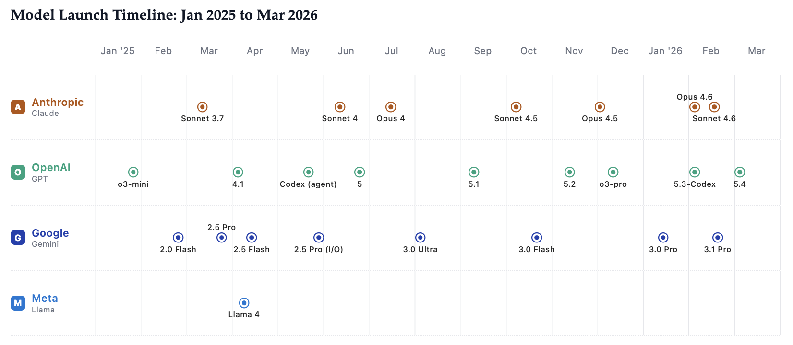

| Date | Anthropic | OpenAI | Google |
|------|-----------|--------|--------|
| Jan 2025 | | [o3-mini](https://openai.com/index/openai-o3-mini/) | |
| Feb 2025 | [Claude 3.7 Sonnet](https://www.anthropic.com/news/claude-3-7-sonnet) | [GPT-4.5](https://openai.com/index/introducing-gpt-4-5/) | [Gemini 2.0 Flash GA](https://blog.google/innovation-and-ai/models-and-research/google-deepmind/gemini-model-updates-february-2025/) |
| Mar 2025 | | | [Gemini 2.5 Pro](https://blog.google/technology/google-deepmind/gemini-model-thinking-updates-march-2025/) |
| Apr 2025 | | [GPT-4.1 family](https://openai.com/index/gpt-4-1/), [o3 + o4-mini](https://openai.com/index/introducing-o3-and-o4-mini/) | [Gemini 2.5 Flash](https://developers.googleblog.com/en/gemini-2-5-thinking-model-updates/) |
| May 2025 | [Claude Opus 4 + Sonnet 4](https://www.anthropic.com/news/claude-4) | [Codex](https://openai.com/index/introducing-codex/) | [Gemini 2.5 Pro (I/O)](https://developers.googleblog.com/en/gemini-2-5-pro-io-improved-coding-performance/), [Deep Think](https://blog.google/innovation-and-ai/models-and-research/google-deepmind/google-gemini-updates-io-2025/) |
| Jun 2025 | | | [Gemini 2.5 Pro/Flash/Flash-Lite GA](https://cloud.google.com/blog/products/ai-machine-learning/gemini-2-5-flash-lite-flash-pro-ga-vertex-ai) |
| Aug 2025 | [Claude Opus 4.1](https://www.anthropic.com/news/claude-opus-4-1) | [GPT-5](https://openai.com/index/introducing-gpt-5/) | |
| Sep 2025 | [Claude Sonnet 4.5](https://www.anthropic.com/news/claude-sonnet-4-5) | | |
| Oct 2025 | [Claude Haiku 4.5](https://www.anthropic.com/news/claude-haiku-4-5) | | |
| Nov 2025 | [Claude Opus 4.5](https://www.anthropic.com/news/claude-opus-4-5) | [GPT-5.1](https://openai.com/index/gpt-5-1/) | [Gemini 3 Pro](https://blog.google/products/gemini/gemini-3/) |
| Dec 2025 | | [GPT-5.2](https://openai.com/index/introducing-gpt-5-2/) | [Gemini 3 Flash](https://blog.google/products/gemini/gemini-drop-december-2025/) |
| Jan 2026 | | [GPT-5.2-Codex](https://openai.com/index/introducing-gpt-5-2-codex/) | |
| **Feb 2026** | **[Claude Opus 4.6](https://www.anthropic.com/news/claude-opus-4-6), [Claude Sonnet 4.6](https://www.anthropic.com/news/claude-sonnet-4-6)** | **[GPT-5.3-Codex](https://openai.com/index/introducing-gpt-5-3-codex/), [GPT-5.3-Codex-Spark](https://openai.com/index/introducing-gpt-5-3-codex-spark/)** | **[Gemini 3.1 Pro](https://blog.google/innovation-and-ai/models-and-research/gemini-models/gemini-3-1-pro/)** |
| **Mar 2026** | | **[GPT-5.4](https://openai.com/index/introducing-gpt-5-4/)** | **[Gemini 3.1 Flash-Lite](https://blog.google/innovation-and-ai/models-and-research/gemini-models/gemini-3-1-flash-lite/)** |

The pace is accelerating. In early 2025, there were a few weeks between major launches - enough time to read the blog posts, try the models, and form an opinion. By late 2025, launches were stacking on top of each other. February 2026 had 5 major launches from all 3 companies in a single month, including the same-day release of Claude Opus 4.6 from Anthropic and GPT-5.3-Codex from OpenAI on February 5.
### *Every launch changes what you can build*

Each launch represents a real shift in what AI can do, from incremental improvements to step changes in model capabilities that unlock entirely new workflows. Whether you're choosing a model for your own work or building AI into a product, each launch changes what's possible.

Between February 5 and March 5, 2026, 3 frontier models (the most capable AI models currently available) launched: Anthropic's Claude Opus 4.6, Google's Gemini 3.1 Pro, and OpenAI's GPT-5.4. Each company published a table of benchmark scores. Each model led on different benchmarks. Which differences matter for your use case and which ones are noise?

The advice you hear from industry leaders is consistent: build for the model coming in 6 months, not the one that works now. To do that, you need to understand the step change improvement with each model release and what it unlocks. You need to be able to look at a benchmark table and know what moved, what it means, and whether it matters for you.

That's benchmark literacy and that's what this article is for.

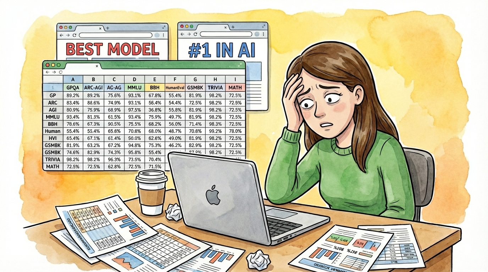

## Benchmarks 101

*What benchmarks actually measure, how models are scored, and the terms you need to know to read the scorecard.*

### A high SAT score doesn't make someone a great colleague

Think of benchmark scores as standardized tests for AI. The SAT is a great signal of a certain type of academic ability - specifically, the ability to take the SAT itself. But you'd never look at a single SAT score and say "this is the best student." You'd use that score as one input into your broader assessment of the student, knowing you need other information to determine: Best at what? Best for which program? Best compared to whom? The SAT is only one type of measurement of a student's capacity.

AI model benchmarks work the same way. Each test measures one narrow skill. A model that aces a coding benchmark might struggle with open-ended reasoning. A model that dominates academic knowledge tests might fall apart when you ask it to use a computer the way you would. A high benchmark score doesn't mean "best model" - it means best at that specific test, under those specific conditions, and on that specific day.

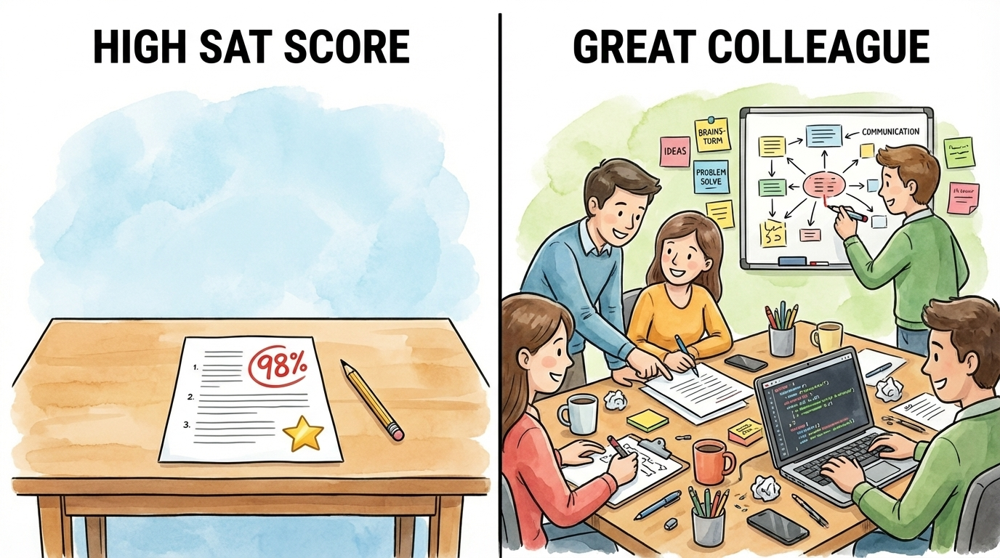

This section covers:

1. What a benchmark is and how models are scored
2. The 4 categories of benchmarks
3. The major benchmarks and what they test

### What a benchmark actually is

A benchmark is a standardized test for an AI model. Benchmarks test models in one of 3 ways: a fixed set of questions, tasks with known correct answers, or head-to-head evaluation where humans compare model outputs directly. Either way, the goal is the same - measure a specific capability and produce a score you can compare across models.

The format varies. Some benchmarks are multiple-choice questions. Some ask the model to write code and check whether the code actually runs. Some present visual puzzles the model has never seen before. And increasingly, benchmarks are moving beyond simple question-and-answer formats. Newer tests ask models to complete complex multi-step tasks like navigating applications, writing and deploying code, or handling multi-turn conversations.

### Benchmarks use one of 3 grading systems

**Pass@1:** The model gets one attempt at each question. If it gets the right answer on the first try, it passes. This is the score most benchmarks report and it's the closest to your actual experience - when you ask Claude or ChatGPT a question, you get one response.

**Pass@k:** The model gets multiple attempts at each question - typically 8 or 16. If *any* attempt produces the right answer, it counts as a pass. Pass@k scores are always higher than pass@1 for the same benchmark. Some companies report pass@k without clearly labeling it, which makes their results look better than they would under pass@1 conditions.

**Elo rating:** Instead of grading against correct answers, Elo is a head-to-head ranking system - the same system used to rank chess players. 2 models are given the same prompt. A human judge reads both responses without knowing which model wrote which and picks the better one. The winning model's rating goes up and the losing model's rating goes down. Over thousands of matchups, the ratings stabilize into a reliable ranking. Higher is better. The platform that runs the largest version of this is called [Chatbot Arena](https://lmarena.ai/), where over 800,000 human votes have been collected. We'll come back to it in the head-to-head section.

Interestingly, research shows humans tend to prefer longer outputs, better formatting (like bullet points), and more agreeable responses - even when shorter, plainer answers are more accurate. Elo measures preference, not correctness.

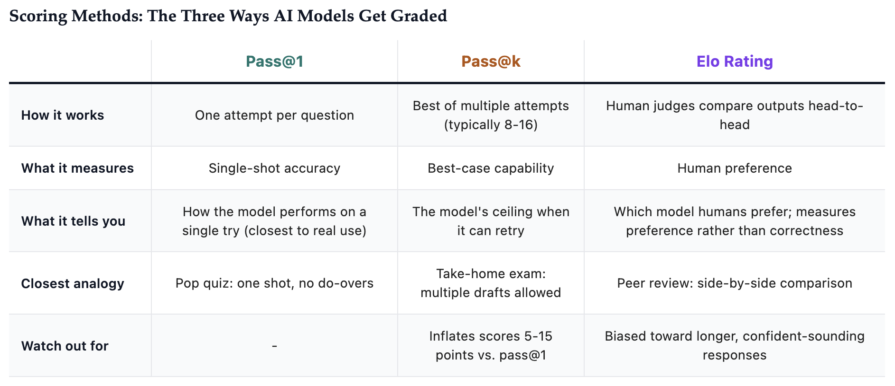

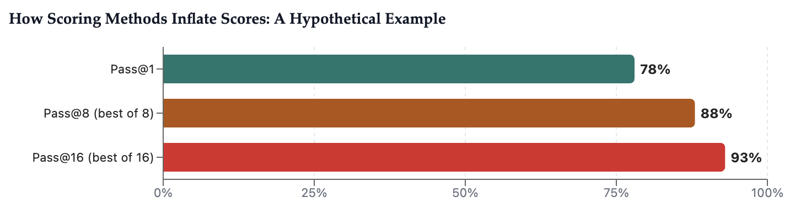

Most benchmark scores in model launch announcements are pass@1. When you see a score without a label, it's usually pass@1 - but if a number seems surprisingly high, check whether the company specified which scoring method they used.

### There are 4 major categories of benchmarks

Most major benchmarks reported in model launches fall into one of 4 categories:

1. **Knowledge & Reasoning:** Does the model know things? SAT-style academic tests scaled up to PhD-level difficulty. General knowledge, science, and professional expertise across dozens of subjects.

2. **Coding:** Can the model write and ship code? Tests whether models can generate code that actually works - from solving programming puzzles to fixing real bugs in open-source projects.

3. **Reasoning:** Can the model think in new ways? Different from knowledge. Knowledge tests check if a model can recall and apply what it learned. Reasoning tests check if it can solve problems it has never seen before - visual patterns, novel logic, and unfamiliar structures.

4. **Agentic & Computer Use:** Can the model do real work? The newest category and for most knowledge workers, the most relevant. Tests whether a model can use a computer like a person - navigating applications, completing multi-step workflows, and handling judgment-intensive professional tasks.

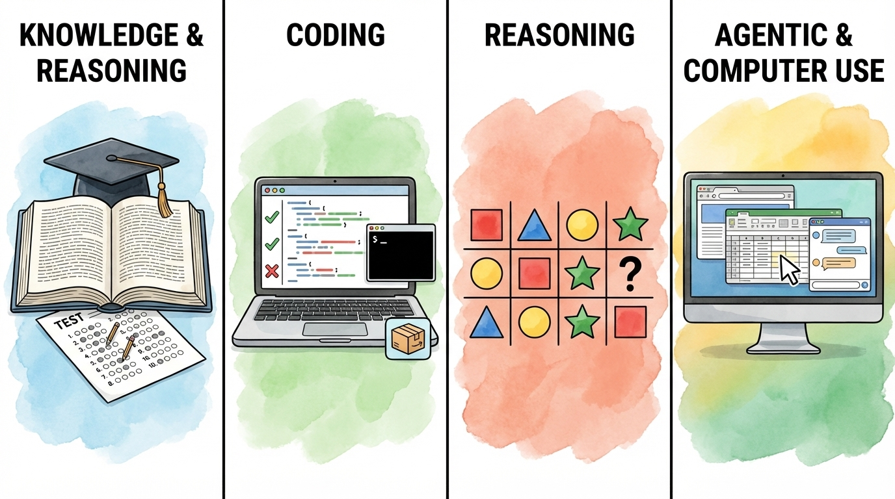

Fairness and safety benchmarks also exist - tests like BBQ (social bias), TruthfulQA (factual accuracy), and HarmBench (resistance to misuse) - but companies rarely include them in launch scorecards. While the rest of this article focuses on the benchmarks that companies actually publish in their scorecards, the absence of fairness and safety reporting in model launches is worth noting.

### Why only a handful of benchmarks become standard

There are thousands of AI benchmarks. Only a handful become the ones companies actually report. For a benchmark to become an industry standard, it needs to clear 3 bars:

1. Hard enough that the models can't immediately max it out
2. Simple enough to produce a single comparable metric
3. Interpretable enough that non-researchers can understand what the score means.

Most proposed benchmarks fail at least one of these requirements - which is why the same dozen or so benchmarks have become the standard every launch announcement.

### The benchmark reference table

Here's every major benchmark you'll encounter in model launch announcements.

| Category | Benchmark | Year Created | Creator | What It Tests | Scoring |
|----------|-----------|-------------|---------|---------------|---------|
| Knowledge & Reasoning | [MMLU](https://arxiv.org/abs/2009.03300) | 2020 | UC Berkeley | 16K questions across 57 academic subjects | Pass@1 |
| Knowledge & Reasoning | [GPQA Diamond](https://arxiv.org/abs/2311.12022) | 2023 | NYU | 448 PhD-level "Google-proof" science questions | Pass@1 |
| Knowledge & Reasoning | [HLE](https://agi.safe.ai/) | 2025 | Center for AI Safety + Scale AI | 2,500 expert-level questions across 100+ subjects | Pass@1 |
| Knowledge & Reasoning | [GDPval](https://openai.com/index/gdpval/) | 2025 | OpenAI | Real-world knowledge work across 44 occupations | Expert-graded |
| Coding | [SWE-bench Verified](https://www.swebench.com/) | 2024 | Princeton NLP + OpenAI | 500 real GitHub issues | Pass@1 |
| Coding | [SWE-bench Pro](https://scale.com/blog/swe-bench-pro) | 2025 | Scale AI | 1,900 tasks with standardized scaffolding (same tools, environment, and setup for every model) | Pass@1 |
| Coding | [SWE-Lancer](https://openai.com/index/swe-lancer/) | 2025 | OpenAI | 1,400+ real Upwork freelance tasks | Pass@1 |
| Reasoning | [ARC-AGI-2](https://arcprize.org/arc-agi/2/) | 2025 | ARC Prize Foundation | Novel visual pattern reasoning | Pass@1 + cost |
| Reasoning | [ARC-AGI-3](https://arcprize.org/arc-agi/3/) | 2026 | ARC Prize Foundation | Interactive game environments requiring exploration / adaptation | Pass@1 + cost |
| Agentic & Computer Use | [OSWorld](https://os-world.github.io/) | 2024 | UHK, CMU, Salesforce Research | Real computer tasks in OS environments | Pass@1 |
| Agentic & Computer Use | [tau2-bench](https://arxiv.org/abs/2506.07982) | 2025 | Sierra Research | Complex customer service operations | Pass@1 |
| Agentic & Computer Use | [BigLaw Bench](https://www.harvey.ai/blog/introducing-biglaw-bench) | 2024 | Harvey AI | Enterprise legal document analysis | Pass@1 |
| Agentic & Computer Use | [Terminal-Bench 2.0](https://terminalbench.com/) | 2025 | Laude Institute (Stanford) | Real command-line terminal tasks | Pass@1 |
| Human Preference | [Chatbot Arena](https://lmarena.ai/) | 2023 | UC Berkeley / LMSYS | Human judges compare model outputs blind | Elo rating |

Now let's go deeper on what each benchmark actually measures and why it matters.

### The major benchmarks

#### Knowledge & Reasoning

This category has 4 benchmarks worth knowing: MMLU, GPQA Diamond, Humanity's Last Exam (HLE), and GDPval.

**[MMLU](https://arxiv.org/abs/2009.03300) (2020)**

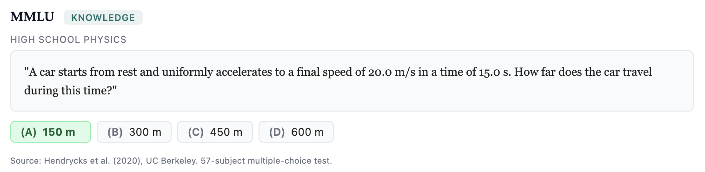

Created by UC Berkeley researchers, MMLU was the original IQ test for AI - roughly 16,000 questions across 57 subjects, from abstract algebra to world religions. For years, it was *the* benchmark everyone cited. Every frontier model now scores between 88% and 93% on this benchmark, which means the test can no longer tell them apart. Its successor, MMLU-Pro, uses harder questions and a more rigorous format - but the original MMLU still appears in launch announcements because companies have years of comparison data on it.

**[GPQA Diamond](https://arxiv.org/abs/2311.12022) (2023)**

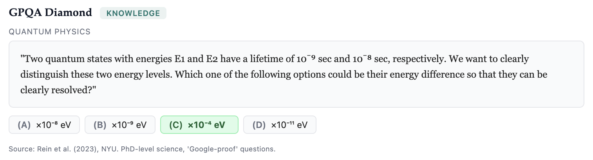

Developed by NYU researchers, GPQA Diamond is 448 PhD-level science questions specifically designed to be "Google-proof" - you can't solve them just by searching. Non-expert humans score around 34%, which gives you a sense of how hard these questions are. Frontier models now cluster between 91% and 94%, which means this test is approaching the same saturation problem as MMLU.

**[Humanity's Last Exam (HLE)](https://agi.safe.ai/) (2025)**

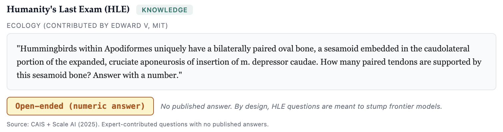

Created by the Center for AI Safety, Scale AI, and roughly 1,000 expert contributors across 500+ institutions. Published in *Nature*. HLE is 2,500 expert-vetted questions across more than 100 subjects, designed to be the ultimate academic exam. Scores currently range from 40% to 45%, which means there's massive headroom for improvement and the test can still meaningfully differentiate between models.

**[GDPval](https://openai.com/index/gdpval/) (2025)**

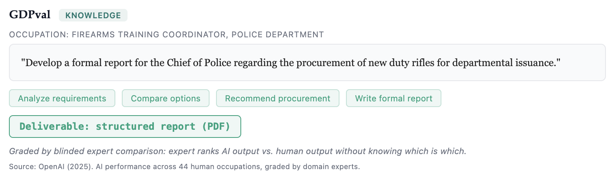

Created by OpenAI, GDPval measures AI performance across 44 human occupations using roughly 1,300 tasks graded by domain experts. Worth noting: OpenAI both created this benchmark and uses it as GPT-5.4's primary metric.

#### Coding

3 coding benchmarks, plus a reality check on what benchmark scores actually mean for real-world software development.

**[SWE-bench Verified](https://www.swebench.com/) (2024)**

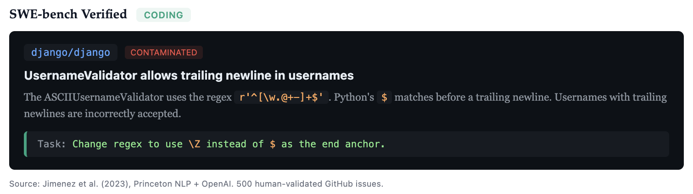

Created by Princeton's NLP group (Verified subset curated with OpenAI), SWE-bench Verified asks models to resolve real GitHub issues - 500 human-validated problems from actual open-source repositories. It was the most-cited coding benchmark in AI for roughly 2 years. We'll come back to why that changed in the next section.

**[SWE-bench Pro](https://scale.com/blog/swe-bench-pro) (2025)**

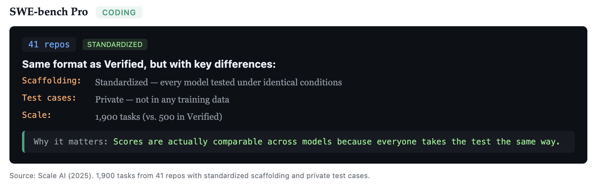

Created by Scale AI as a replacement for SWE-bench Verified. SWE-bench Pro has roughly 1,900 tasks from 41 repositories with standardized scaffolding (the same tools, environment, and setup for every model) and private test cases that aren't in any training data. When standardized scaffolding is used to test every model under the same conditions, the scores are actually comparable.

**[SWE-Lancer](https://openai.com/index/swe-lancer/)**

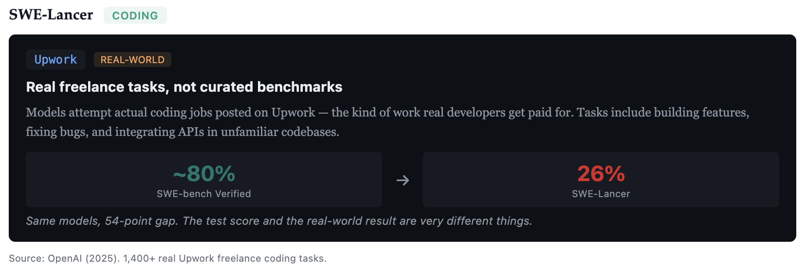

Created by OpenAI, SWE-Lancer tests models on over 1,400 real freelance coding tasks sourced from Upwork, ranging from $50 bug fixes to $32,000 feature builds. Unlike SWE-bench, which uses open-source GitHub issues, SWE-Lancer measures whether a model can do the kind of paid software development work for which companies actually pay. The results are a reality check: an 80% SWE-bench score translates to just 26% on SWE-Lancer.

**The real-world gap**

Despite significant advances in model performance on coding benchmarks, the difference in performance between SWE-bench and SWE-Lancer scores demonstrates that there is still significant work needed before AI models can autonomously develop software. A March 2026 study by METR, an AI safety research nonprofit, had actual repository maintainers review AI-generated pull requests that had "passed" SWE-bench's automated grader. Roughly half of the "passing" code would be rejected in a real code review.

***The test score tells you the model can write code. It doesn't tell you the model can ship code.***

#### Reasoning

2 benchmarks define this category and they represent both where AI reasoning is now and how far it still has to go.

**[ARC-AGI-3](https://arcprize.org/arc-agi/3/) (2026)**

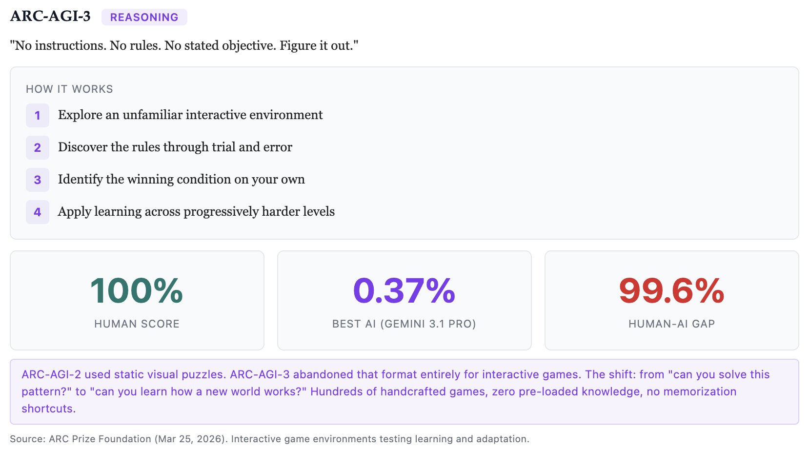

Created by the ARC Prize Foundation and launched March 25, 2026. ARC-AGI-3 abandoned static puzzles entirely in favor of interactive, game-like environments. There are no instructions, no rules, and no stated objectives. AI agents must explore unfamiliar environments, discover the mechanics, identify winning conditions, and apply what they learn across progressively harder levels. Humans are able to solve any of the interactive game environments. AI models barely crack any of them: Gemini 3.1 Pro scores 0.37%, GPT-5.4 scores 0.26%, and Opus 4.6 scores 0.25%. This is the widest gap between human and AI performance on any current benchmark and it measures the capability that static benchmarks cannot: learning from experience in real time. Like ARC-AGI-2, it measures cost alongside accuracy.

**[ARC-AGI-2](https://arcprize.org/arc-agi/2/) (2025)**

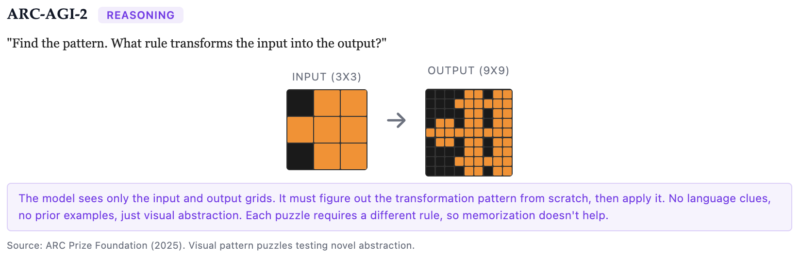

Created by the ARC Prize Foundation (founded by Francois Chollet). ARC-AGI-2 uses visual pattern puzzles that test whether a model can reason about novel problems. The puzzles are specifically designed so that memorization doesn't help - each one requires figuring out the underlying pattern from scratch. Scores are still widely spread - from 53% to 77% across frontier models - so the test can meaningfully differentiate. ARC-AGI-2 is also the first major benchmark to measure cost alongside accuracy, which we'll come back to in the cost section.

#### Agentic & Computer Use

4 benchmarks test whether models can do sustained professional work, not just answer questions.

**[OSWorld](https://os-world.github.io/) (2024)**

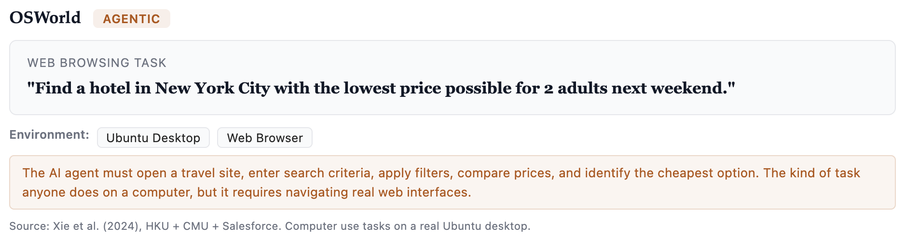

Created by an academic consortium including the University of Hong Kong, Carnegie Mellon, and Salesforce Research. OSWorld tests whether a model can use a computer like a human - navigating operating systems, using applications, completing workflows across multiple tools. GPT-5.4 scored 75% on OSWorld, surpassing human performance at 72.4% - one of the first times any model has genuinely exceeded what humans can do on a practical task.

**[tau2-bench](https://sierra.ai/uk/blog/benchmarking-agents-in-collaborative-real-world-scenarios) (2025), [BigLaw Bench](https://www.harvey.ai/blog/introducing-biglaw-bench) (2024), and Finance Agent (2025-2026)**

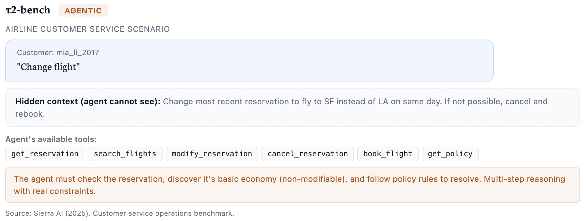

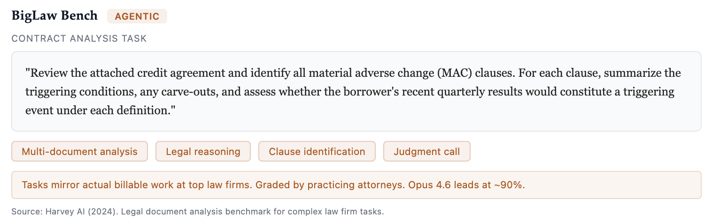

These are domain-specific agentic benchmarks. Tau2-bench, created by [Sierra](https://sierra.ai/), tests complex customer service operations. BigLaw Bench, created by [Harvey AI](https://www.harvey.ai/), tests legal document analysis. Finance Agent tests financial agent workflows. They measure whether a model can handle the kind of multi-step, judgment-intensive work that companies actually pay people to do. These benchmarks are relatively new and they test capabilities that directly map to real professional work.

**[Terminal-Bench 2.0](https://terminalbench.com/) (2025)**

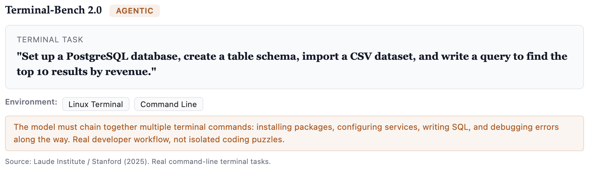

Created by Mike Merrill, Alex Shaw, and a team of 85 contributors under the Laude Institute, with roots at Stanford University. Terminal-Bench 2.0 tests whether models can do real command-line work: the kind of terminal-based tasks that developers and system administrators handle daily. GPT-5.3-Codex leads at 77.3%, with Gemini 3.1 Pro at 68.5% and Opus 4.6 at 65.4%. Independently created, with scores spread enough to meaningfully differentiate.

Now you know every major benchmark by name, what it tests, and who created it. But knowing what exists isn't enough. You need to know which of these to actually pay attention to and that starts with understanding why some benchmarks stop working.

## Why benchmarks expire: When everyone gets an A, the A stops meaning anything

You now know what each benchmark tests. But how long does a benchmark stay useful?

Not as long as you'd think. Benchmarks have a shelf life that is rapidly getting shorter. [Ethan Mollick](https://www.oneusefulthing.org), a Wharton professor who researches and writes about AI's impact on work and education, aggregated multiple independent benchmark datasets in a [March 2026 analysis](https://www.oneusefulthing.org/p/the-shape-of-the-thing) and found the same pattern everywhere: AI capabilities themselves show no signs of plateauing. The models keep getting measurably better - it's the benchmarks that can't keep up. Understanding why benchmarks expire and knowing which questions to ask about any benchmark score is the difference between reading new AI model releases and actually understanding what they mean.

Benchmarks expire for 3 reasons:

1. Models improve faster than new tests can be developed
2. Training data gets contaminated over time
3. Optimization pressure turns measures into targets

### 1. Models improve faster than new tests can be developed

Benchmark designers create a test that challenges the current generation of models. By the time the test is widely adopted, the next generation of models has already outgrown the test. This is called **saturation** - when every model scores so high that the test can no longer tell them apart. The scores converge, the spread disappears, and the test becomes noise. It's the standardized testing equivalent of grade inflation.

MMLU lasted about 3 years before every frontier model scored between 88% and 93%. GPQA Diamond, released in 2023, was designed to be harder - PhD-level science questions that you can't solve just by searching. But just 2 years later, frontier models are already clustering between 91% and 94%.

### 2. Training data gets contaminated over time

The longer a benchmark has been public, the more likely its questions and answers have leaked into the training data that models learn from. This is called **contamination** - when a model has already seen the test answers in the training data. This is the epitome of teaching to the test, at industrial scale.

In February 2026, OpenAI published an audit of SWE-bench Verified - the most-cited coding benchmark in AI. They found that every frontier model's training data included the test solutions. The models had essentially seen the answers before taking the test and the benchmark had been unreliable for roughly 2 years.

That's not a one-off failure - it's a structural risk. Any benchmark with publicly available test questions will eventually end up in training data. Benchmarks with private test sets like SWE-bench Pro are specifically designed to resist this - but for public benchmarks, the longer they've been available, the less reliable the scores become.

How did OpenAI know? Their audit didn't inspect training data directly. They found that models could reproduce verbatim code patches and quote specific problem details from GitHub issues - strong circumstantial evidence that the test solutions had been absorbed during training. The clincher: when models were tested on SWE-bench Pro (which uses private test cases not available in any training data), scores dropped by 57 points. The gap between public and private test performance told the story.

### 3. Optimization pressure turns measures into targets

There's a principle called [Goodhart's Law](https://en.wikipedia.org/wiki/Goodhart%27s_law): when a measure becomes a target, it ceases to be a good measure. This principle applies perfectly here. Once a benchmark becomes the standard that companies use to market their models, every company starts optimizing specifically for that benchmark. Companies are not just building better models - they're building models that are better at *this particular test*. The benchmark stops measuring general capability and starts measuring how well a model has been tuned to perform on one narrow set of tasks.

### The cycle compounds - and it's accelerating

The combined forces of saturation, contamination, and optimization pressure create a cycle. A benchmark gets published, models train on its data, companies optimize for its scores, the test saturates, and a new benchmark has to be designed from scratch. Then the cycle starts again - faster each time.

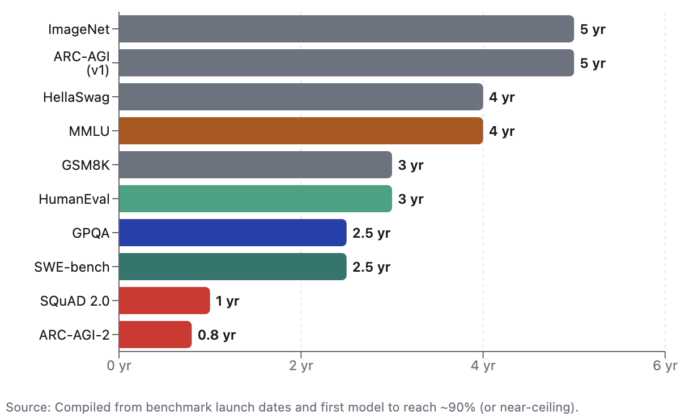

ImageNet, one of the earliest AI benchmarks, lasted about 5 years before models saturated it. MMLU made it roughly 3. SWE-bench Verified was unreliable within 2. And ARC-AGI-2 - specifically designed to resist this cycle with visual puzzles that can't be memorized - went from single digit scores to models scoring 77% in under a year.

On March 25, 2026, while this article was being finalized, the ARC Prize Foundation launched ARC-AGI-3. The response to ARC-AGI-2's rapid saturation was radical: abandon static puzzles entirely. ARC-AGI-3 uses interactive game environments where agents must explore, learn rules, and adapt with zero instructions. The best frontier model scores 0.37%. Humans score 100%. The treadmill didn't just reset. It changed the track.

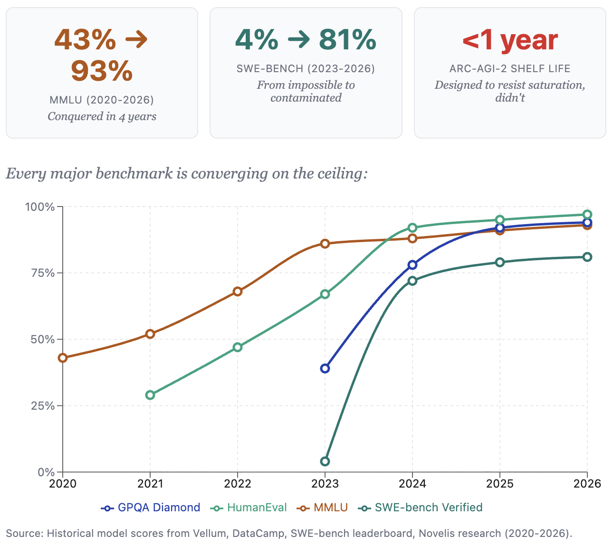

The window between "this test is meaningful" and "this test is useless" is collapsing. ARC-AGI-2 is still a useful benchmark, with a meaningful spread in scores (53% to 77% across frontier models). But ARC-AGI-3 just showed us what the next generation looks like: a 99.6% gap between human and AI performance, on a test that measures learning rather than pattern matching. Even the best-designed static tests have a shorter and shorter shelf life and the benchmark designers are now pivoting to entirely new formats to stay ahead.

When a benchmark expires, creating a replacement isn't straightforward. The new test has to clear the same adoption bar - hard enough to differentiate, reducible to a single metric, and interpretable to non-researchers - while also being resistant to the contamination and optimization pressures that killed its predecessor. This is why replacement cycles are slow and why the industry often continues citing expired benchmarks long after they've stopped being useful.

### So which benchmarks are still working right now?

If benchmarks keep expiring, how do you know which scores are still relevant? There are 3 questions to ask about every benchmark you encounter:

1. **How long has the test been public?** The longer a benchmark has been available, the more likely models have been trained on its answers. A test that's been public since 2020 has had 6 years of potential contamination. A test launched in 2025 is still relatively clean. When companies disclose the year range of a model's training data (which they sometimes do for open-source models), you can cross-reference that against when a benchmark was published.

2. **Who created it?** Did an independent university or research consortium build the test? Or did the company reporting the highest score also design the exam?

3. **Are the scores still spread out?** If one model scores 53% and another scores 77%, the test is doing its job - it can tell them apart. If every frontier model scores between 88% and 93%, the test has saturated and can no longer differentiate.

### Where each benchmark stands right now

Applying those 3 questions to every benchmark we covered:

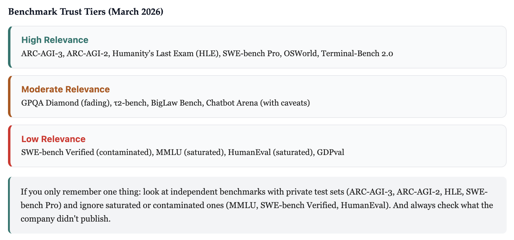

**High Relevance**

| Benchmark | Why |
|-----------|-----|
| ARC-AGI-3 | Launched March 25, 2026, by the ARC Prize Foundation. The first fully interactive reasoning benchmark: agents must explore unfamiliar game environments, discover rules, and adapt with no instructions. Humans solve 100%, best AI scores 0.37%. The widest human-AI gap on any current benchmark. Independent, contamination-resistant by design, and the farthest from saturation of any benchmark in existence. When you want to know how far AI still has to go on genuine learning, this is where to look. |
| ARC-AGI-2 | Independently created by the ARC Prize Foundation with no company involvement. Designed to resist contamination - you can't memorize visual pattern puzzles. Scores are still widely spread (53% to 77% across frontier models), so the test can meaningfully differentiate. Also one of the first benchmarks to measure cost-per-task alongside accuracy. When you want to know which model is actually the best *thinker* - not the best at recalling answers, but the best at reasoning through unfamiliar problems - this is where you look. |
| HLE | Created by an independent consortium of 1,000+ experts across 500+ institutions, published in *Nature*. Scores range from 40% to 45%, which means there's massive headroom for improvement and the test can still meaningfully differentiate between models. This is where you want to look when comparing knowledge capabilities. |
| SWE-bench Pro | Created by Scale AI as a successor to the compromised SWE-bench Verified. Standardized scaffolding (the same tools, environment, and setup for every model) and private test cases mean the scores are actually comparable across models. Currently the best coding benchmark. |
| OSWorld | Created by an academic consortium (University of Hong Kong, Carnegie Mellon, Salesforce Research). Relatively new, limiting contamination risk and the score spread across models is still meaningful. GPT-5.4 scored 75%, surpassing human performance at 72.4% - one of the first benchmarks where a model has genuinely exceeded what humans can do on a practical task. When people ask "when will AI actually replace parts of my workflow?" - this is the benchmark tracking that question. |
| Terminal-Bench 2.0 | Independently created by the Laude Institute (Stanford). Tests real command-line tasks, which directly maps to developer workflows. Scores are spread enough to differentiate (65-77%), recent enough to avoid contamination, and 3 major labs have reported scores. Meets all 3 criteria: independent creation, wide score spread, contamination-resistant. |

**Moderate Relevance**

| Benchmark | Why |
|-----------|-----|
| GPQA Diamond | Strong methodology - 448 PhD-level science questions designed to be "Google-proof." When GPQA Diamond launched, it was a meaningful differentiator. But frontier models now cluster between 91% and 94%, which means the test is approaching the same saturation problem as MMLU. It's not useless yet, but it's losing its ability to tell models apart. |
| tau2-bench | Early but important. Opus 4.6 leads here at 99.3%. Created by Sierra Research, independently built and too new to have contamination concerns. Tests capabilities that directly map to real professional work. The scores tell you something concrete: if your work involves enterprise-level agentic tasks, Opus is currently the model to beat. Limited track record is the only reason it's not high relevance yet. |
| BigLaw Bench | Early but important. Opus 4.6 leads here at 90.2%. Created by Harvey AI, independently built and too new to have contamination concerns. Tests complex legal document analysis that maps directly to real professional work. Same caveat as tau2-bench: limited track record. |
| GDPval | The methodology is solid - real-world knowledge work across 44 occupations, graded by domain experts. Note that OpenAI both created and scores the highest on this benchmark. |
| MMLU Pro | Harder successor to MMLU with 12,032 questions in a 10-option format (vs. MMLU's 4-option). Scores are more spread out than the saturated original (frontier models range from roughly 82% to 90%), so it still differentiates. But it's a knowledge test on the same trajectory and it will eventually saturate the way MMLU did. Worth watching, not yet expired. |

**Low Relevance**

| Benchmark | Why |
|-----------|-----|
| MMLU | Saturated. Every frontier model scores between 88% and 93%, so the test can no longer tell them apart. Worse, researchers found a 6.5% error rate in the test's own questions - the exam itself gets roughly 1 in 15 answers wrong. MMLU has been dropped from most major evaluations. When you see it in a launch announcement, it's padding. |
| SWE-bench Verified | Contaminated. OpenAI's own February 2026 audit confirmed that every frontier model's training data included the test solutions. The most-cited coding benchmark in AI had been unreliable for roughly 2 years. When you see this score in a launch announcement, the number looks impressive, but the test behind it is broken. |
| HumanEval | Saturated. Created by OpenAI as one of the earliest coding benchmarks - 164 Python programming challenges. Frontier models now score 95%+, making it useless for differentiation. Like MMLU, it served its purpose and has been outgrown. |

The pattern is consistent: ***independent creation + wide score spread + resistance to contamination = high relevance.*** Fail any one of those 3 and you should discount the score accordingly.

### Where to check scores yourself

You don't have to wait for launch announcements to compare models. These 5 independent sources publish up-to-date benchmark data:

- **[Chatbot Arena](https://lmarena.ai/):** Human preference rankings from 800,000+ blind votes
- **[Artificial Analysis](https://artificialanalysis.ai/):** Price-performance rankings and capability comparisons
- **[ARC Prize Leaderboard](https://arcprize.org/leaderboard):** Reasoning benchmark scores with cost data
- **[Scale AI SWE-bench Pro Leaderboard](https://labs.scale.com/leaderboard/swe_bench_pro_public):** Current coding benchmark standings
- **[Stanford CRFM Foundation Model Transparency Index](https://crfm.stanford.edu/fmti/):** How much companies disclose about their models

Now you know what the benchmarks are and which ones are still relevant. Let's see if you can read a real one.

## Apply what you've learned: You can now read the scorecard

*Everything you've learned so far, applied to a real benchmark table.*

You now know what benchmarks are, how models are scored, what each major test measures, why benchmarks expire, and which ones are still relevant. Let's put it into practice.

Here's the real benchmark table from [Anthropic's Opus 4.6 launch announcement](https://www.anthropic.com/news/claude-opus-4-6) on February 5, 2026. Now, you can read and understand every line.

| Benchmark | Category | Opus 4.6 Score | Scoring Method |
|-----------|----------|---------------|----------------|
| HLE | Knowledge | ~45% | pass@1 |
| GPQA Diamond | Knowledge | 91.3% | pass@1 |
| ARC-AGI-2 | Reasoning | 68.8% | pass@1 |
| SWE-bench Verified | Coding | ~74% | pass@1 |
| Terminal-Bench 2.0 | Coding | Leader | pass@1 |
| tau2-bench | Agentic | 99.3% | pass@1 |
| BigLaw Bench | Agentic | 90.2% | pass@1 |
| GDPval-AA | Professional | Highest Elo | Elo rating |

### You recognize every name on this table

HLE is the hardest academic knowledge exam currently in use - 2,500 expert-vetted questions across more than 100 subjects. GPQA Diamond is the graduate-level science test that's approaching saturation. ARC-AGI-2 tests novel visual reasoning that can't be memorized. SWE-bench Verified is the coding benchmark that was contaminated for 2 years. Terminal-Bench 2.0 tests real command-line work. tau2-bench and BigLaw measure enterprise agentic tasks - complex, multi-step professional work. GDPval-AA (a specific configuration of the GDPval benchmark) evaluates performance across 44 real occupations.

### You know what the scores actually mean

Most of these report pass@1 - one attempt, no do-overs. That's the score that reflects what you'd experience as a user, because when you ask Claude a question, you get one response. The GDPval-AA row uses Elo rating instead - the head-to-head system from chess where models are ranked against each other rather than graded against correct answers.

If any of these reported pass@8 or pass@16 instead of pass@1, you'd know to discount the score. None of these do - Anthropic reports pass@1 across the board here - but you know to check.

### You can evaluate how relevant every score is

| Benchmark | Score | Relevance | Why |
|-----------|-------|-----------|-----|
| HLE | ~45% | High | Independently created, massive headroom (40% to 45% range across frontier models), still differentiates |
| GPQA Diamond | 91.3% | Fading | Frontier models cluster between 91% and 94% - approaching the same saturation problem as MMLU |
| ARC-AGI-2 | 68.8% | High | Wide score spread across models (53% to 77%), independently created, designed to resist contamination |
| SWE-bench Verified | ~74% | Low | Contaminated - every frontier model's training data included the test solutions |
| Terminal-Bench 2.0 | 65.4% | High | Independently created by the Laude Institute (Stanford), scores spread enough to differentiate (65-77%), 3 major labs have reported scores |
| tau2-bench | 99.3% | Moderate | Independent and maps directly to real professional work, but limited track record |
| BigLaw Bench | 90.2% | Moderate | Independent and maps directly to real professional work, but limited track record |
| GDPval-AA | Highest Elo | Moderate | Solid methodology, but not independently created - OpenAI built and leads on this benchmark |

That's what benchmark literacy looks like. Not memorizing scores - understanding what they mean and what they don't.

But a single scorecard only tells you about one model. Anthropic published theirs. OpenAI published theirs. Google published theirs. Each one looks impressive in isolation. What happens when you put all 3 side by side?

## How to read the next model launch

*Putting it all together: the head-to-head comparison and what to watch for in any announcement.*

### No single model wins

Here are all 3 frontier models from February-March 2026 side by side on the same benchmarks.

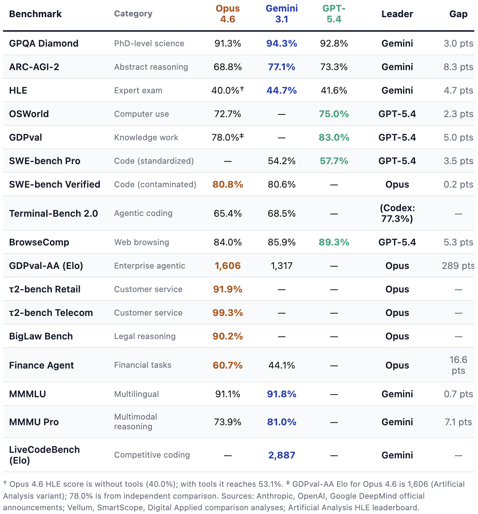

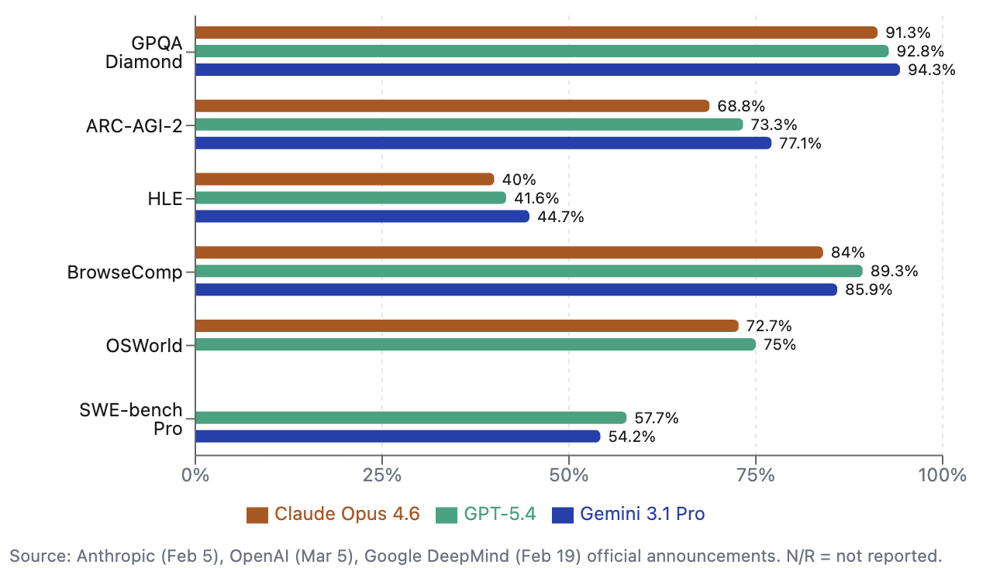

The "best model" entirely depends on what you need it to do. Gemini 3.1 Pro leads on academic reasoning - GPQA Diamond, ARC-AGI-2, and HLE. GPT-5.4 leads on professional tasks - OSWorld (where it surpassed human performance), GDPval, and SWE-bench Pro. Opus 4.6 leads on enterprise agentic work - tau2-bench, BigLaw Bench, and Terminal-Bench 2.0.

A researcher, a software engineer, and a legal analyst would each look at this same table and come away with a different answer - and they'd all be right.

### 4 things to watch for in any launch announcement

You already know how to evaluate individual benchmark scores. Here's what to look for in the announcement itself - the framing, the comparisons, and the context around the numbers.

**1. What's missing from the scorecard?**

Every company highlights the benchmarks where their model leads. When GPT-5.3-Codex launched, it came with only 4 benchmark scores out of dozens available. The head-to-head table above makes this visible - blank cells are scores a company chose not to publish. It's also worth noting that no scorecards include fairness and safety benchmarks.

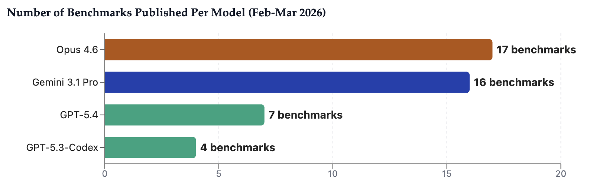

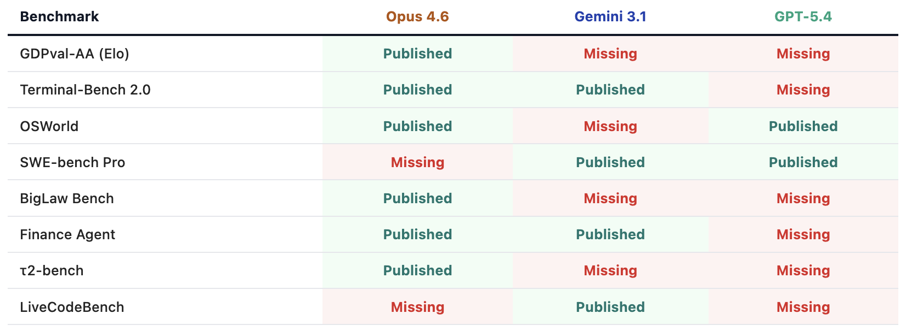

**2. Which models are they comparing against?**

When Anthropic launched Opus 4.6 in February, they compared it to GPT-5.2. By March, GPT-5.4 had launched - and that comparison was already outdated.

**3. How does human preference compare to the benchmark story?**

Benchmarks measure specific capabilities. [Chatbot Arena](https://lmarena.ai/) measures something different: when real people compare model outputs side by side with no brand names, which one do they prefer? As of early 2026, the top 5 models are separated by just 19 Elo points - statistically, that's noise. The gaps that matter show up in specialized tasks (enterprise agentic work, complex coding, and novel reasoning), not in everyday conversation.

**4. How transparent is the methodology?**

Stanford's Foundation Model Transparency Index tracks how much AI companies disclose about their models. Average transparency scores dropped from 58/100 to 40/100 in a single year.

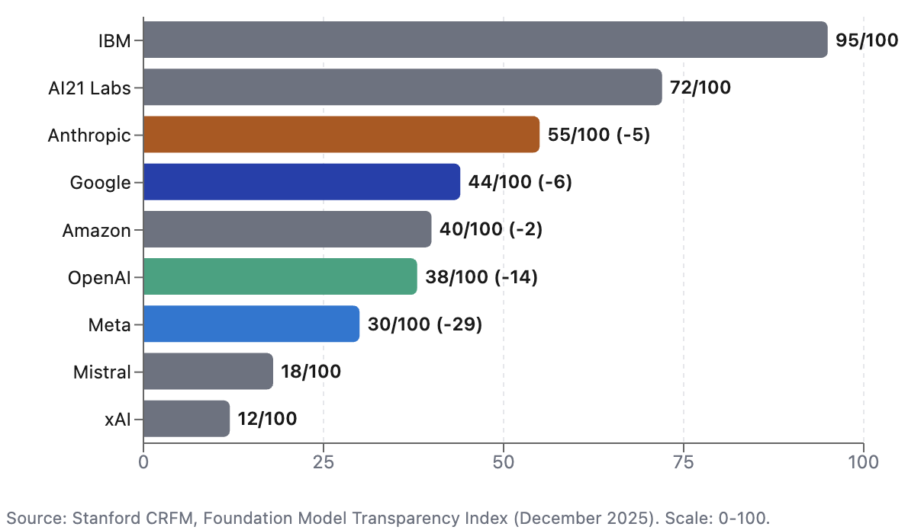

As models converge in capability, companies are publishing less context alongside their numbers. The practical effect is that reading a launch announcement today requires more interpretation than it did a year ago.

## What the scorecard leaves out: The SAT doesn't tell you about tuition

*If you're building AI-powered products, you need to evaluate the overall cost and ROI of AI in your product. Benchmark scores tell you what a model can do, but not what it costs to do it at scale.*

When you're making API calls at scale, the cost of each request directly impacts whether your product is profitable. Even a small price difference per query adds up quickly when you're making thousands or millions of requests. And 2 models can score nearly identically on the benchmarks that matter, but on API pricing (how AI is priced when built into products), one can cost 5 times more than the other. No benchmark table includes this. Here's how API pricing works:

When you build AI into a product, your product uses a model like Claude or GPT through an **API** - a connection between your software and the AI model. Here's how it works:

1. Your product sends a **request** to the model. The text you send is measured in **input tokens**. A **token** is a small chunk of text, roughly three-quarters of a word.
2. The model sends a **response** back, measured in **output tokens**. Output costs more because generating new text takes more compute than reading it.
3. You pay for both directions. Prices are quoted per million tokens - that's the unit you'll see in the comparisons below.

Pricing is different for input and output tokens because output costs more to generate. For example, Opus 4.6 charges $5 per million input tokens and $25 per million output tokens - 5x more for the response than the request.

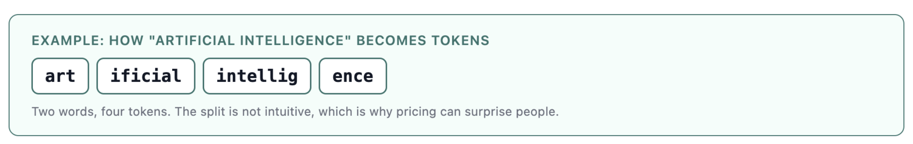

### Same scores, wildly different prices

Here's what the same benchmarks look like when you add price to the picture. The chart below compares output token pricing because that's where the real cost difference shows up. Output tokens cost significantly more than input tokens (for Opus 4.6, output is 5x the input price), and for most use cases, output is the majority of your bill.

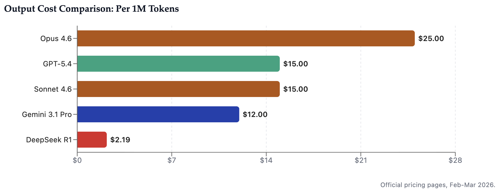

[DeepSeek](https://www.deepseek.com/), a Chinese AI company, released a reasoning model called R1 that matches frontier performance on key reasoning benchmarks at $2.19 per million output tokens. For comparison, the same API call costs $15 on GPT-5.4 and $25 on Opus 4.6.

Sonnet 4.6 ($15 per million output tokens) scores 72.5% on OSWorld - just 0.2 points behind Opus at $25. On SWE-bench Pro, the gap is similarly narrow. When a mid-tier model at 60% of the price delivers 95% of flagship performance on relevant benchmarks, evaluating performance without cost doesn't give you the full picture. It's like ranking colleges by academic reputation without mentioning tuition.

If you're using AI through a consumer subscription - $20/month for ChatGPT or Claude - you're not paying per token, but providers rate-limit expensive models more aggressively. For example, you'll hit rate limits faster on Opus than on Sonnet.

### Cost-adjusted evaluation is coming

The benchmarking world is starting to catch up. ARC-AGI-2 is the first major benchmark to measure cost-per-task alongside accuracy - not just "did the model get it right?" but "how much did it cost to get it right?" [Artificial Analysis](https://artificialanalysis.ai/) publishes price-performance rankings that plot capability against cost.

Right now, cost-adjusted evaluation is emerging but not yet standard. Most benchmark tables still don't include it. But when cost becomes a standard part of how we evaluate models, the competitive landscape will reshuffle. The model that wins on raw performance isn't always the model that wins on performance-per-dollar - and for most use cases, performance-per-dollar is the metric that actually matters.

Now you have the full picture - benchmarks, trust, and cost. Let's apply everything to 3 real launches.

## Reading the 3 February-March 2026 launches

With all of this in mind, here's how to read the 3 February-March 2026 launches.

**Opus 4.6 (February 5, 2026)**

Anthropic launched Opus 4.6 as the most capable model for complex, long-running work. The headline benchmarks: Humanity's Last Exam (high relevance, where Opus leads), Terminal-Bench 2.0, and the enterprise agentic tests - tau2-bench at 99.3% and BigLaw at 90.2% (both high relevance). Plus a 1M context window.

The informed read: Opus 4.6 is genuinely the strongest model for enterprise agentic work and long-context professional tasks. At $5 input / $25 output per 1M tokens, it's also the most expensive frontier model on the market. The question isn't whether Opus is the best at what it does - it's whether the gap justifies the price.

**Sonnet 4.6 (February 17, 2026)**

12 days later, Anthropic released Sonnet 4.6. The headline: Opus-level intelligence at Sonnet pricing, with 1M context and computer use. The most interesting number: in human preference testing, Sonnet 4.6 was preferred over Opus 4.5 59% of the time. Notice the baseline - that's Opus 4.5, not Opus 4.6.

The informed read: Sonnet 4.6 is the most interesting model of the 3 for most readers. It delivers close to flagship performance at a fraction of the cost. At $3 input / $15 output per 1M tokens (40% cheaper than Opus on output), the gap between Sonnet 4.6 and Opus 4.6 on most benchmarks is narrow enough that the price difference becomes the deciding factor for everyday work.

**GPT-5.4 (March 5, 2026)**

OpenAI launched GPT-5.4 with the biggest headline: a 75% score on OSWorld, surpassing the human baseline of 72.4%. This is the first time any AI model has outperformed humans on a computer use benchmark - a genuinely significant milestone. OpenAI also highlighted GDPval (moderate relevance) and SWE-bench Pro (high relevance).

The informed read: GPT-5.4 leads on professional tasks and computer use and the OSWorld milestone is the most concrete achievement across all 3 launches. At $2.50 input / $15 output per 1M tokens, it's competitive with Sonnet 4.6 on output and cheaper on input.

## Best for what? At what price? On which tests?

Opus 4.6 is the best model for enterprise agentic work at $25 per million output tokens. Sonnet 4.6 delivers near-flagship performance for everyday work at $15 per million output tokens. GPT-5.4 leads on professional tasks and hit a genuine human-surpassing milestone on the OSWorld benchmark, also at $15 per million output tokens.

Right now, no single model wins across the board. Gemini 3.1 Pro leads on academic reasoning. GPT-5.4 leads on professional tasks and computer use. Opus 4.6 leads on enterprise agentic work. The best model is the one that does the work you need, at a price you can justify, on benchmarks you understand.

## You can read the next model announcement yourself

If you've followed along, you now have:

- **A clear understanding of what benchmarks are and how AI models are scored:** Standardized tests with defined tasks, scoring criteria, and controlled conditions - scored with pass@1, pass@k, or Elo ratings.
- **The 4 categories of benchmarks - knowledge, coding, reasoning, and agentic - and which ones still matter:** Why benchmarks expire and how fast it's happening, and how to spot when a test has stopped being useful through saturation, contamination, or optimization pressure.
- **The ability to read a real benchmark scorecard and a head-to-head model comparison:** What each number means, what to focus on, what the missing entries tell you, and 4 things to watch for in any launch announcement.
- **An understanding of when and why cost matters:** If you're building AI-powered products, cost might matter more than scores. If you're on a consumer subscription, cost shows up as rate limits.
- **The confidence to read the next model launch announcement yourself:** You've applied everything in this guide to Opus 4.6, Sonnet 4.6, and GPT-5.4 - and read 3 real scorecards from 3 different launch announcements.

The next time a new model launches, you'll be able to read the scorecard yourself. You'll know which benchmarks were highlighted, which ones were left out, whether the benchmarks included still differentiate, and what the price tag actually means for the AI-powered products you're building.

***The best model is the one that does the work you need, at a price you can justify, on benchmarks you understand.***

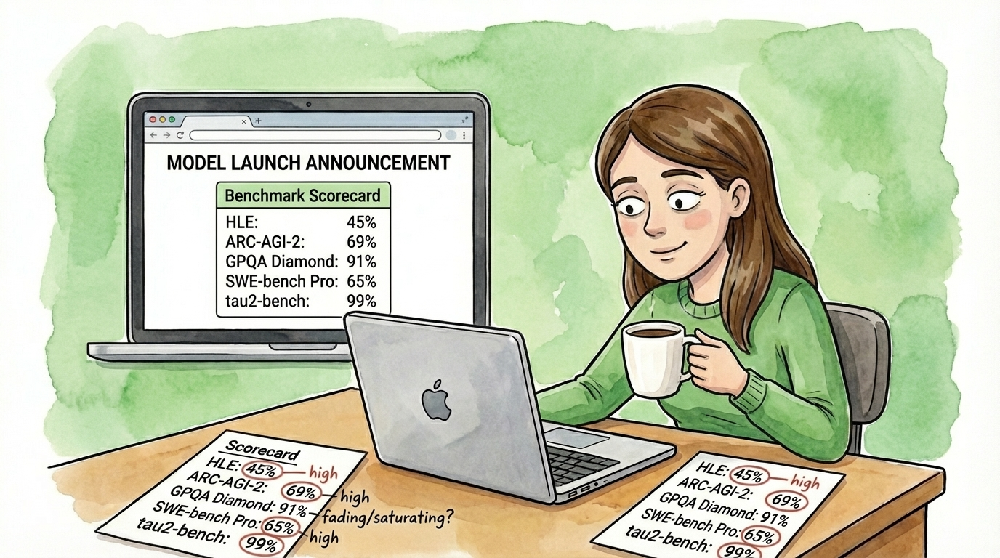
